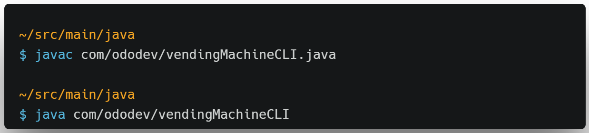
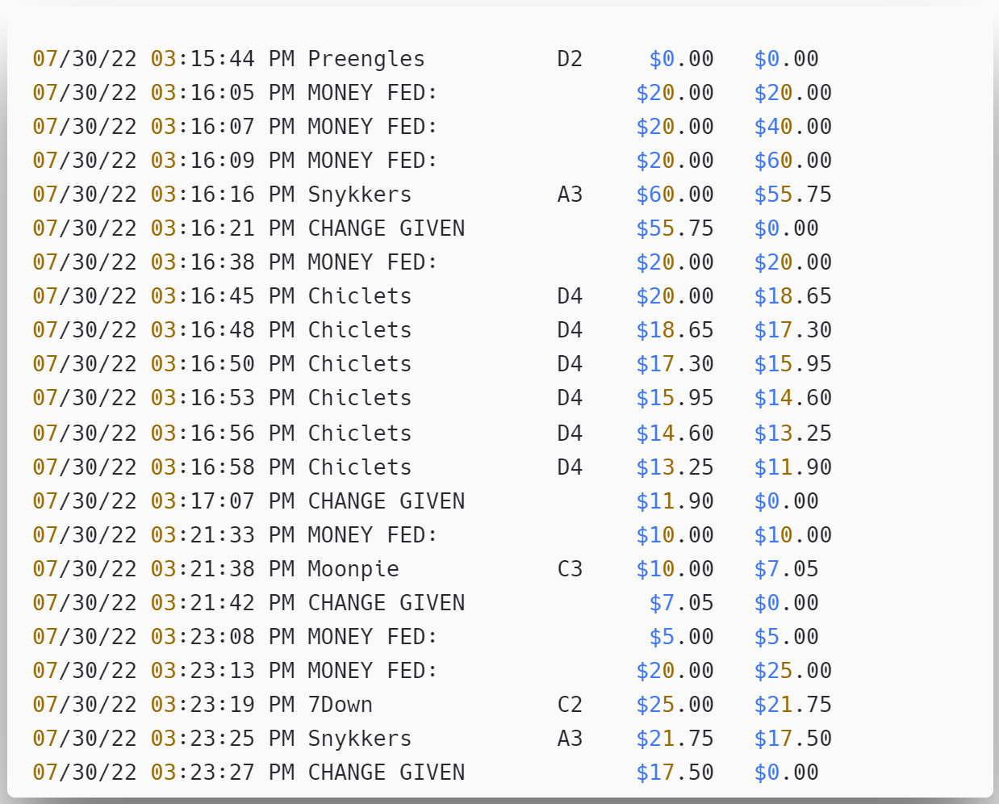

# Vending Machine Application

## Quick Set Up Instructions
Compile VendingMachine.java, then execute the main method of the VendingMachineCLI class. 

To run the program directly from the terminal window, route to the java directory and enter the following commands:

Note: JDK must be installed in order to compile from the terminal.

## Program Structure
 - ### Models
    - `Item` abstract class -- no instances of `Item` but subclasses inherited properties `name` and `price`, and abstract methods.
    - `Candy`, `Drink`, `Gum`, and `Munchy` all extend `Item` and override the abstract dispenseMessage() method
 - ### Application
    - `VendingMachine` class contains methods run(), purchaseMenu(), and dispense()
 - ### User Interface
    - `UserInput` includes methods feedMoney() and selectItem() -- reads in user input to the console from the Scanner(System.in)
    - `UserOutput` includes methods displayHomeScreen(), displayInventory(), displayReturnChange(), etc. -- prints output to the console 
 - ### Helpers
    - `ChangeHelper` class contains the returnChange() helper method, to calculate exact change in dollar bills and coins
 - ### Reader and Logger
    - the `FileRead` class reads in the inventory from the input file "catering.csv" when the application starts (example lines from file:)
    > ```
    > A1,Preengles,2.35,Munchy
    > A1,Chippos,2.55,Munchy
    > B2,Papsi,3.45,Drink
    > D1,Moonpie,2.95,Candy
    > ```
    - If the filepath is invalid, readFile() catches a `FileNotFoundException` and prints 'File not found' to the console.
    - the `Logger` class has a custom constructor which creates an Audit.txt logger file, and a write() method which prints to the log.
    <br>
    Sample Audit.txt log file after executing the program:
    
#

## Nested Menu Screens
A main menu must display when the software runs, presenting the following options:
    
    > ```
    > (D) Display Vending Items
    > (P) Purchase
    > (E) Exit
    > ```

 - When the customer selects "(D) Display Vending Items", they're presented
   with a list of all items in the machine with its quantity remaining:
   
    - Each product has a slot identifier and a purchase price.
    - Each slot has enough room for 6 of that product.
    - Every product is initially stocked to the maximum amount.
    - A product that has run out must indicate that it is NO LONGER AVAILABLE.

 - When the customer selects "(P) Purchase", they are guided through the purchasing
   process menu:
   
    >```
    >(M) Feed Money
    >(S) Select Item
    >(F) Finish Transaction
    >
    > Current Money Provided: $2.00
    >```

    1. Selecting "(M) Feed Money" allows the customer to repeatedly feed money into the machine in valid, whole dollar amounts — for example, $1, $5, $10, or $20.
        - The "Current Money Provided" indicates how much money the customer
        has fed into the machine.
    2. Selecting "(S) Select Item" allows the customer to select an item to
       purchase.
        - Show the list of items available and allow the customer to enter
        a slot identifier to select an item.
        - If the item (slot identifier) does not exist, the customer is informed and returned to the Purchase menu.
        - If a product is NO LONGER AVAILABLE, the customer is informed and returned to the Purchase menu.
        - If a valid item is selected, it is dispensed to the customer.
        - After the item is dispensed, the machine must update its balance
        accordingly and return the customer to the Purchase menu.
    3. Selecting "(F) Finish Transaction" allows the customer to complete the
       transaction and receive any remaining change.
        - The customer's money is returned using nickels, dimes, quarters, and dollars (single dollars)
        (using the smallest amount of coins possible).
- After completing their purchase, the user is returned to the "Main" menu to continue using the Vending machine.

<br>

## Unit Testing
The test classes listed below encapsulate the JUnit tests for the following units:

 Test Class            | Methods Tested 
------------------------|-------------
 VendingMachineTests    | `dispense()` 
 ChangeHelperTests      | `returnChange()`                
 UserInputTests         | `feedMoney()`, `getPurchaseScreenOption`, and `selectItem()`                          

